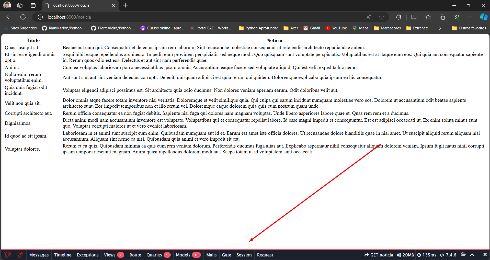
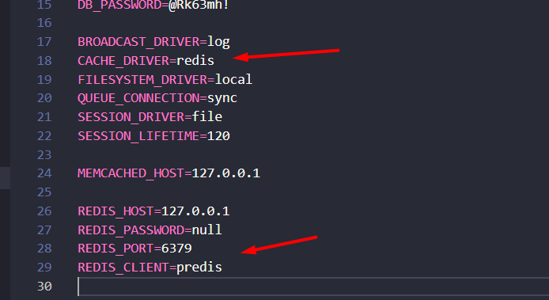

# AppPortalNoticias-Redis
Curso desenvolvimento web completo Laravel - Estudo do Redis
## Criando projeto com composer.phar:
`$ php composer.phar create-project --prefer-dist laravel/laravel=8.5.20 app_portal_noticias`

## instalando debugBar no projeto:
`$ php composer.phar require barryvdh/laravel-debugbar=v3.6.2 --dev`

## instalan do o predis:
$ php composer.phar require predis/predis=v1.1.7
* Fazendo as configurações no env
